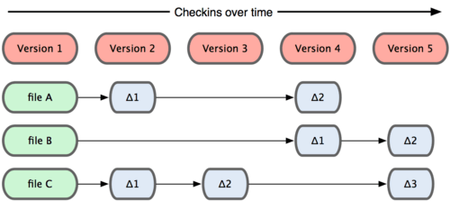

[Voltar](README.md)

# Conceitos

Definição da Wikipedia (https://pt.wikipedia.org/wiki/Git)

Git pronunciado [git] (ou pronunciado [dit] em inglês britânico) é um sistema de controle de versões distribuído, usado principalmente no desenvolvimento de software, mas pode ser usado para registrar o histórico de edições de qualquer tipo de arquivo. O Git é um software livre, foi criado em 2005 por Linus Torvalds para o desenvolvimento do kernel Linux, mas foi adotado por muitos outros projetos. 

Conforme a definição, o git é um sistema de controle de versão distribuído (DVCS), o que significa que o código fonte não fica armazenado apenas em um repositório central, mas cada desenvolvedor que trabalha em determinado projeto possui uma imagem completa contendo todas as revisões, ou seja, toda a história de evolução do projeto.

Isto permite trabalhar localmente numa cópia sem a necessidade de utilizar o repositório central para verificar outras revisões e fazer comparações.
Outra característica é que a partir de qualquer cópia do repositório é possível recriar o projeto, mesmo em caso de um desastre no repositório principal.

Antes de iniciar o aprendizado dos conceitos do git, é necessário “limpar a mente” de conceitos utilizados em outros softwares de controle de versão, como o subversion.

O git armazena e pensa nas informações de uma forma bem diferente que os sistemas tradicionais de controle de versão. Seguem algumas características que diferenciam o git de outros softwares como o subversion:
 * armazena ‘snapshots’ e não diferenças entre as versões
 * a maior parte das operações são realizadas localmente (commit, tag, branch, diff, lo, checkout, merge)
 * poucas operações remotas: clone, pull, push, fetch
 * integridade das revisões utilizando “SHA-1”
 * é possível controlar revisões localmente sem a necessidade de um servidor

O SHA-1 gerado é uma string de 40 caracteres hexadecimal, baseado no conteúdo dos arquivos e pastas.

## Versões dos arquivo no subversion e git

### Subversion
Quando um arquivo é modificado num projeto que está sob o controle do svn, somente as diferenças entre cada versão são armazenadas.

## git

Quando arquivos de um projeto são alterados no git, cada arquivo modificado possui uma cópia completa na versão em que foi alterado.

[Voltar](README.md)