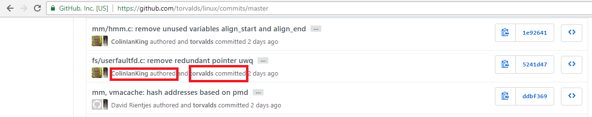

[Voltar](README.md)

# git log

```
git log
```


```
git log --oneline --graph --all --decorate
```


```
git log --oneline
```


----

## Author x Commiter

 * Author: pessoa que originalmente escreveu o patch.

 * Commiter: pessoa que aplicou o patch pela última vez no projeto.



----

## Estrutura de Dados Internas


[Voltar](README.md)