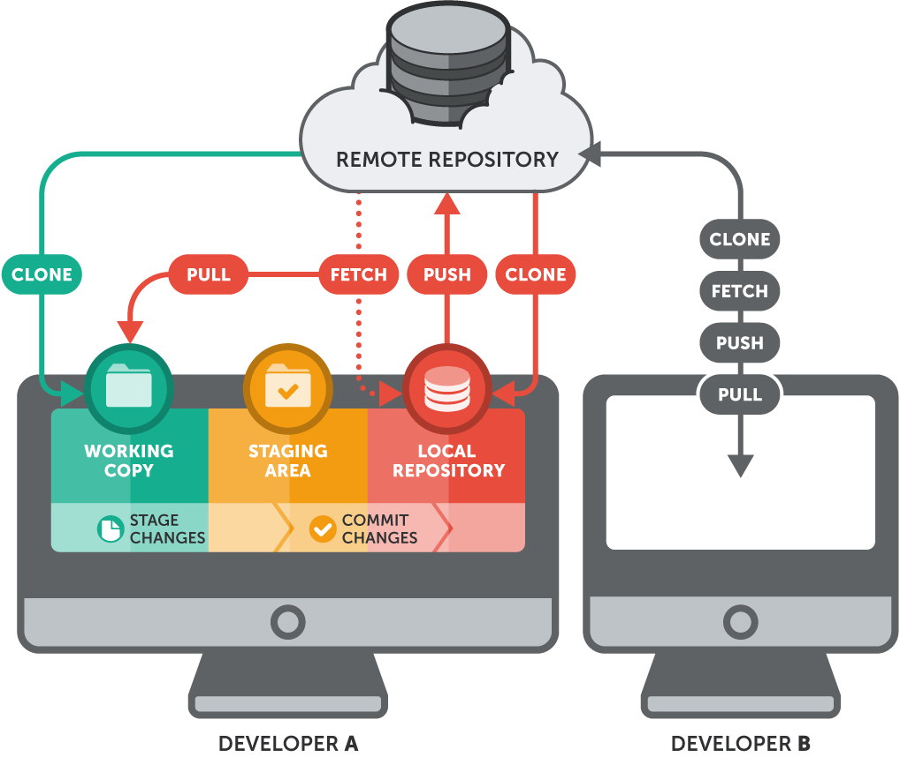

[Voltar](README.md)

# Repositórios Remotos



## git clone

Faz um **clone** de um repositório remoto para uma pasta local.
O clone contém uma cópia completa do projeto, com todas as alterações, commits e logs.

```
git clone https://github.com/nginx/nginx.git
git clone https://github.com/nginx/nginx.git projeto-nginx
```

Ao invés do nome padrão **origin** é possível atribuir outro nome ao repositório:
```
$ git clone https://github.com/nginx/nginx.git -o  github
Cloning into 'nginx'...
remote: Counting objects: 56932, done.
remote: Compressing objects: 100% (42/42), done.
remote: Total 56932 (delta 42), reused 57 (delta 36), pack-reused 56854
Receiving objects: 100% (56932/56932), 54.72 MiB | 747.00 KiB/s, done.
Resolving deltas: 100% (43752/43752), done.
$ cd nginx
$ git remote -v
github  https://github.com/nginx/nginx.git (fetch)
github  https://github.com/nginx/nginx.git (push)
```

Etapas envolvidas (implícitas ao git clone):
 * criação da pasta nginx (mkdir nginx; cd nginx)
 * criação da estrutura da pasta nginx/.git (git init)
 * adição do repositório remoto (git remote add origin …)
 * download do conteúdo do repositório para a pasta nginx/.git (git fetch)
 * cópia dos arquivos para o área de trabalho (git checkout master)


## git fetch

A operação **git fetch** atualiza o repositório local com novos commits ocorridos no repositório remoto.

git fetch não atualiza a área de trabalho e nem faz merge.

## git pull

**git pull** atualiza o repositório local com novos commits do repositório remoto e faz o merge com o branch atual. É uma sequência de git fetch e git merge.

----
## git remote add <remote-name> <url>

Adiciona a url de configuração de um repositório remoto.

```
git remote add gitlab git@gitlab.com:jairo.gubler/treinamento-git.git
```

----
## git push <remote> <branch>

Envia um branch local para um repositório remoto.

```
git push origin master
git push gitlab master
```
----

## git remote rename

Alterar o nome de referência do repositório remoto:
```
git remote rename origin github
```
----
## git remote -v

Exibe informações sobre os remotos.
```
$ git remote -v
github  git@github.com:jairogubler/treinamento-git.git (fetch)
github  git@github.com:jairogubler/treinamento-git.git (push)
gitlab  git@gitlab.com:jairo.gubler/treinamento-git.git (fetch)
gitlab  git@gitlab.com:jairo.gubler/treinamento-git.git (push)
```

## Protocolos utilizados:

 * local: repositório em outra pasta local ou remota (nfs, por exemplo) 
 * http: informando usuário e senha e também permite acesso anônimo
 * ssh: através de chave pública privada/pública

 É necessário utilizar uma chave ssh para acesso a repositórios via protocolos git/ssh, configurável via interface WEB da ferramenta.

```
ssh-keygen -t rsa
cat ~/.ssh/id_rsa.pub
 ``` 
  * gitlab: https://gitlab.com/profile/keys
  * github: https://github.com/settings/keys
  
[Voltar](README.md)